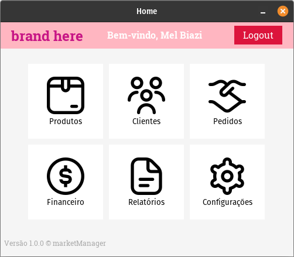
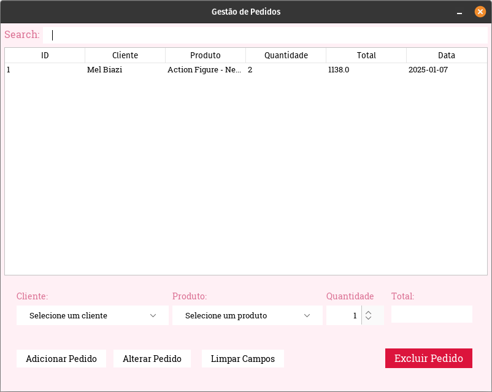
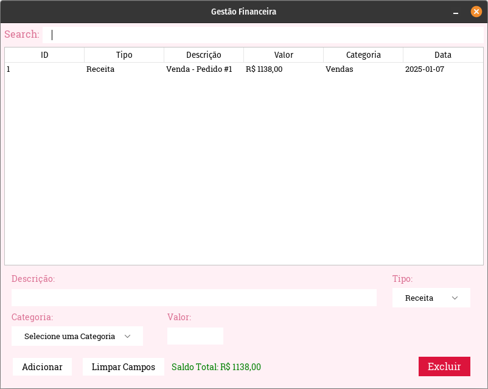
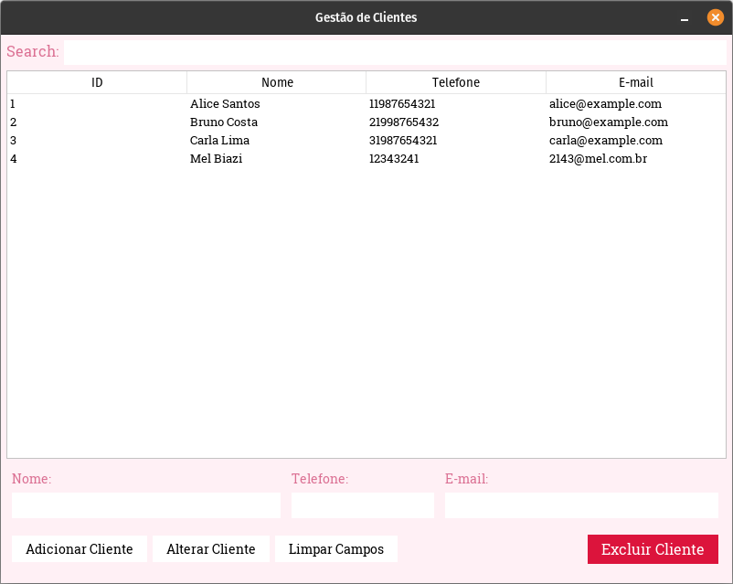
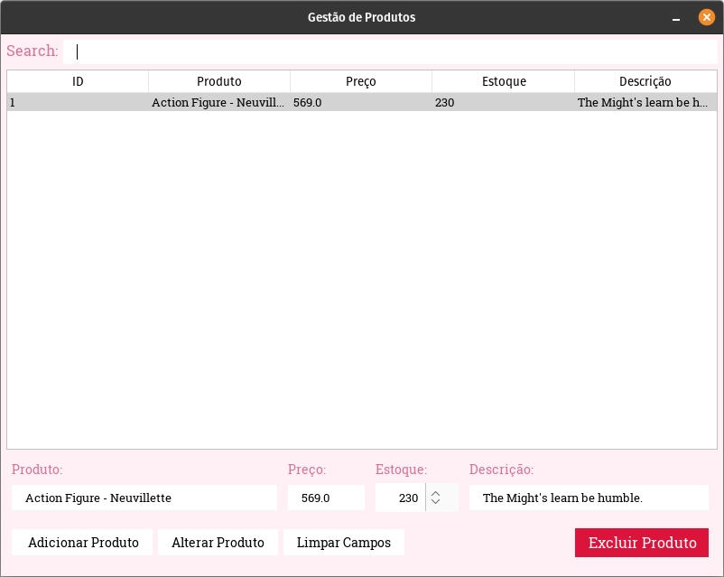

# MarketManager

MarketManager é um sistema de gestão de pedidos e financeiro desenvolvido em Java com Swing. O projeto foi criado para facilitar o gerenciamento de clientes, produtos, pedidos e transações financeiras em pequenas empresas.

---


## Capturas de Tela

### Tela Principal


### Tela de Cadastro de Pedidos


### Relatórios Financeiros


### Tela de Cadastro de Clientes


### Tela de Cadastro de Produtos



---

## Funcionalidades

### Pedidos
- **Cadastro de Pedidos**: Adicione novos pedidos vinculados a clientes e produtos.
- **Edição de Pedidos**: Atualize informações de pedidos existentes.
- **Visualização de Pedidos**: Liste todos os pedidos na tabela.
- **Cálculo Automático**: Calcule automaticamente o valor total com base no preço do produto e na quantidade.

### Financeiro
- **Gerenciamento de Transações**: Registre receitas e despesas da empresa.
- **Categorias**: Classifique transações em categorias como "Vendas", "Gastos Operacionais", "Materiais" etc.
- **Saldo Dinâmico**: Visualize o saldo total com indicação de valores positivos ou negativos (cores).

### Clientes e Produtos
- **Cadastro de Clientes e Produtos**: Gerencie clientes e produtos diretamente pela interface.
- **Comboboxes Dinâmicos**: Popule os comboboxes de cliente e produto com dados do banco.

### Interface
- **Responsividade**: Campos como "Total" atualizam automaticamente ao alterar quantidade ou produto.
- **População de Campos**: Preencha automaticamente os campos ao selecionar itens na tabela.

---

## Pré-requisitos

- **Java 17 ou superior**
- **NetBeans** ou outro IDE compatível
- **MySQL**

---

## Configuração do Banco de Dados

1. Crie um banco de dados chamado `marketManager`.
2. Importe o arquivo `marketManagerDump.sql` localizado no repositório para configurar automaticamente o banco de dados.
   
   Comando sugerido para importar:
   ```bash
   mysql -u seu_usuario -p marketManager < caminho/para/marketManagerDump.sql
   ```

3. Atualize as configurações de conexão no código Java:

```java
private static final String URL = "jdbc:mysql://localhost:3306/marketManager";
private static final String USER = "seu_usuario";
private static final String PASSWORD = "sua_senha";
```

---

## Como Executar

1. Clone o repositório:
   ```bash
   git clone https://github.com/seu-usuario/MarketManager.git
   ```

2. Importe o projeto no NetBeans ou outra IDE.
3. Compile e execute o projeto.
4. Use a tela de login como ponto de entrada.

---

## Estrutura do Projeto

```plaintext
src/main/java/com/gates/marketmanager/
├── database/              # Gerenciamento de conexão com o banco de dados
├── models/                # Classes modelo para representar entidades (Cliente, Produto, Pedido, etc.)
├── views/                 # Telas e componentes visuais
└── controllers/           # Lógica de negócios e controle de fluxo
```

---

## Melhorias Futuras

- Adicionar relatórios financeiros detalhados.
- Implementar gráficos para análise de receitas e despesas.
- Criar um sistema de autenticação robusto para múltiplos usuários.

---

## Contribuições

Contribuições são bem-vindas! Sinta-se à vontade para abrir issues ou pull requests.

---

## Licença

Este projeto está licenciado sob a [MIT License](LICENSE).
